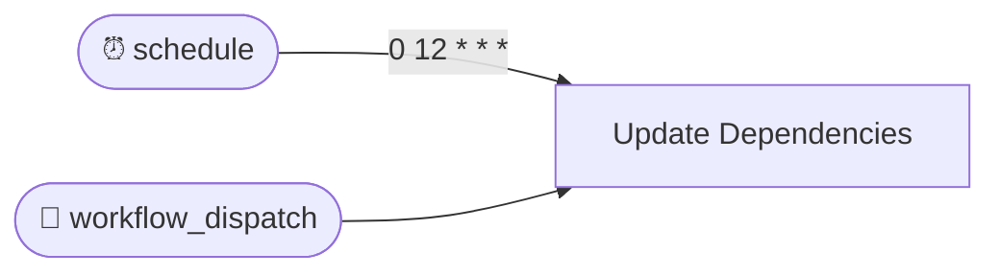

# Workflows

```mermaid
flowchart LR
    schedule(["⏰ schedule"])
    workflowdispatch(["👤 workflow_dispatch"])
    updatedependenciesyml["Update Dependencies"]
    schedule -->|"0 12 * * *"|updatedependenciesyml
    workflowdispatch --> updatedependenciesyml
```

## Workflows

- [Update Dependencies](./update-dependencies/)