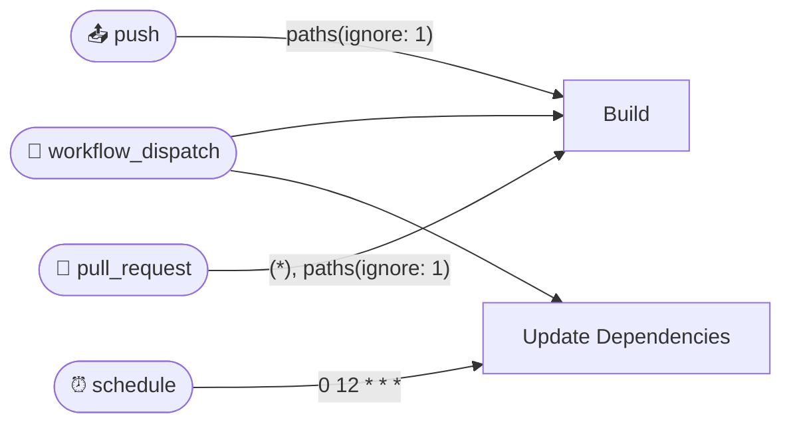

# Workflows

```mermaid
flowchart LR
    workflowdispatch(["👤 workflow_dispatch"])
    push(["📤 push"])
    pullrequest(["🔀 pull_request"])
    schedule(["⏰ schedule"])
    buildyml["Build"]
    updatedependenciesyml["Update Dependencies"]
    workflowdispatch --> buildyml
    workflowdispatch --> updatedependenciesyml
    push -->|"paths(ignore: 1)"|buildyml
    pullrequest -->|"(*), paths(ignore: 1)"|buildyml
    schedule -->|"0 12 * * *"|updatedependenciesyml
```

## Workflows

- [Build](./build/)
- [Update Dependencies](./update-dependencies/)