# Workflows

- **Build**
- **Deploy to Production**

## Table of Contents

- [Workflow Triggers - Flowchart](#workflow-triggers---flowchart)
- [Build](#build)
- [Deploy to Production](#deploy-to-production)

## Workflow Triggers - Flowchart

```mermaid
flowchart LR
    workflow_dispatch(["👤 workflow_dispatch"])
    push(["📤 push<br/>branches#91;ignore: 1#93;, paths#91;ignore: 1#93;"])
    pull_request(["🔀 pull_request<br/>#91;*#93;"])
    build[Build]
    deploy_to_production[Deploy to Production]
    workflow_dispatch --> build
    push --> build
    push --> deploy_to_production
    pull_request --> build
```

## Build

```mermaid
%%{init: {"flowchart": {"curve": "basis"}}}%%
flowchart TD
    workflow_dispatch(["👤 workflow_dispatch"])
    push(["📤 push<br/>branches#91;ignore: 1#93;, paths#91;ignore: 1#93;"])
    pull_request(["🔀 pull_request<br/>#91;*#93;"])
    subgraph build["Build"]
        build_metadata[["🔧 Workflow Config<br/>🔐 custom permissions"]]
        build_build["build<br/>🐧 ubuntu-latest"]
    end
    workflow_dispatch --> build_build
    push --> build_build
    pull_request --> build_build
```

## Deploy to Production

```mermaid
%%{init: {"flowchart": {"curve": "basis"}}}%%
flowchart TD
    push(["📤 push<br/>branches#91;only: 1#93;, paths#91;only: 1#93;"])
    subgraph deploy_to_production["Deploy to Production"]
        deploy_to_production_build["build<br/>🐧 ubuntu-latest"]
        deploy_to_production_deploy["deploy<br/>🐧 ubuntu-latest"]
        deploy_to_production_build --> deploy_to_production_deploy
    end
    push --> deploy_to_production_build
```

