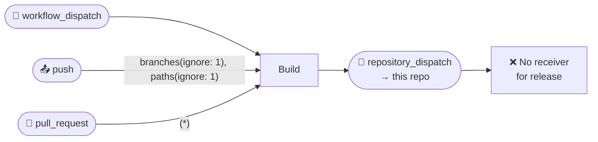

# Workflows

```mermaid
flowchart LR
    workflowdispatch(["👤 workflow_dispatch"])
    push(["📤 push"])
    pullrequest(["🔀 pull_request"])
    repositorydispatchgithubrepository(["🔔 repository_dispatch<br/>→ this repo"])
    build["Build"]
    noreceiverrelease["❌ No receiver<br/>for release"]
    workflowdispatch --> build
    push -->|"branches(ignore: 1), paths(ignore: 1)"|build
    pullrequest -->|"(*)"|build
    build --> repositorydispatchgithubrepository
    repositorydispatchgithubrepository --> noreceiverrelease
```

## Workflows

- [Build](./build/)